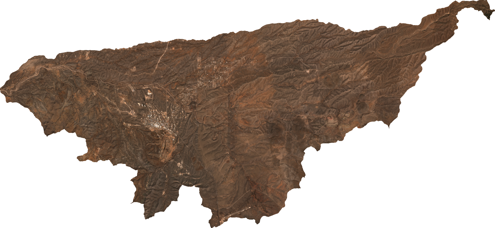
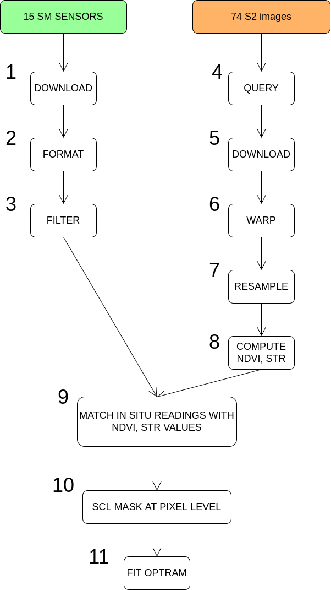
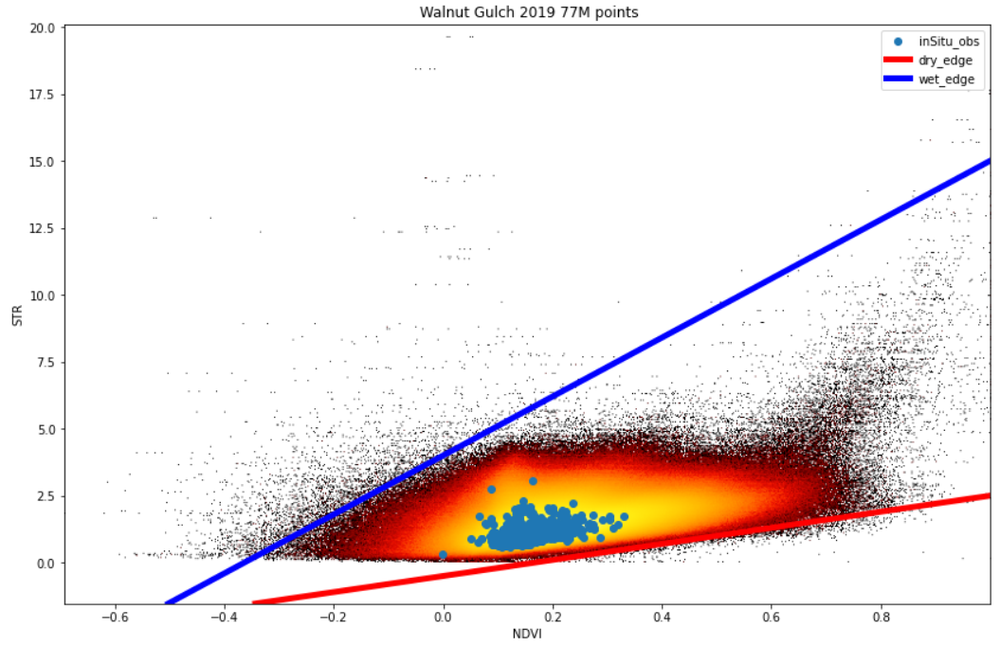
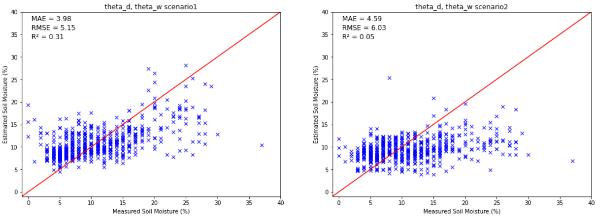
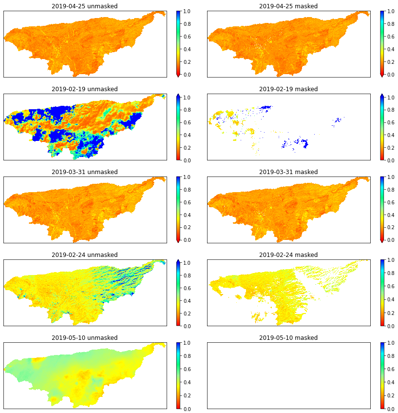

# Implementation of Optical Trapezoid Model (OPTRAM) with Sentinel 2 

\\[ \frac{1}{n^{2}} \\]

The Optical Trapezoid Model (OPTRAM) was developed to overcome the limitations of the Thermal-Optical Trapezoid Model (TOTRAM), i.e., non aplicability to satellites that do not provide thermal data, and the requirement of parametrization for each individual date. Based on Short Wave Infrared Reflectance (SWIR), Normalized Difference Vegetation Index (NDVI) and in situ measurements at surface level, the OPTRAM has demostrated to be a significant advance for remote sensing of soil moisture with great importance to undestand seasonal dynamics, water resource planning and agricultural production.

The present work its a implementation of the OPTRAM based on the paper [sadegui et al 2017](https://www.sciencedirect.com/science/article/abs/pii/S0034425717302493), however some differences are worth mentioning: 

- Only the Galnut Gulch Watershed area has been modelized, leaving aside Little Washita.
- 71 Sentinel2 BOA (Level 2A) images corresponding to 2019 TOA (Level 1C) have been used, in contrast to the 17 images corresponding to the year 2015 used in the article. Because of BOA level, radiometric, atmospheric and geometric corrections were not needed.

- The Sentinel2 [SCL](https://sentinels.copernicus.eu/web/sentinel/technical-guides/sentinel-2-msi/level-2a/algorithm) band was used as a single mask to filter water bodies, clouds, saturated pixels, etc, as a consequence, the clustering and water body classification models of the original article were not necessary.

- Both methods for the estimation of the $\theta_d$, $\theta_w$ coefficients, corresponding to the two scenarios presented in the original article have been implemented, although only the first scenario is fully developed.

Adittionaly in some parts, the implementation makes advantage of parallel computations to process the tens of millions of data to be computed in a single computer.

## Data fusion

  

- **1-3** : Sensor processing, the filtering of incomplete sensors will be performed here.
- **4-8** : Very complex but made easy by [sen2r](http://sen2r.ranghetti.info/index.html) library in R, rasterio and gdal in python.
- **9**   : This data fusion is key to obtain a full implementation of the OPTRAM model. The sensor readings of each station are matched with the nearest pixels of each image at the acqusition time, allowing for volumetric content water (%) predictions once the model is validated. Aditionally a big speed up is achieved using the parallel library [Dask](https://dask.org/). 
- **10**  : The Scheme Classification Layer ([SCL](https://sentinels.copernicus.eu/web/sentinel/technical-guides/sentinel-2-msi/level-2a/algorithm)) already computed by Copernicus is used to mask the defective pixels, i.e., clouds, snow, shadows, etc.
- **11**  : Finally, with the filtered data and inSitu fusion observations the OPTRAM can be fitted.

## NDVI-STR space

  

## Results 

  

## W maps

  

